# OrdersIn

**The order book that already speaks WhatsApp.**

A mobile web app that runs the daily operations of a one-person food business — orders, billing, payments, stock and customers — without asking anyone to change how they already work.

### 🔗 [**Try the live app → tiffinbook-react.netlify.app**](https://tiffinbook-react.netlify.app)

> **This is a live product in supervised beta, used by a real home kitchen taking real customer orders.** It is not a demo, a tutorial project, or a portfolio exercise built to be looked at.

---

## What it does

A home kitchen takes its orders over WhatsApp. The order is a message, the payment is a UPI screenshot, and the record of who owes what lives in the owner's head or a paper notebook. Things get missed, dues go uncollected, and the owner has no idea which dishes actually make money.

OrdersIn replaces the notebook without replacing WhatsApp. Orders — whether typed in by the owner or placed by customers through a public link — land in one list on the owner's phone. From there the owner moves an order through preparing, out for delivery and delivered, generates an itemised bill with a UPI QR code, sends it straight back to the customer on WhatsApp, and marks it paid when the money lands. Underneath, the app keeps the menu and its true cost per dish, ingredient stock that depletes as orders go out, every customer's history and dues, and a running picture of what the business actually earned.

It works in **English, Hindi and Kannada**, installs to the home screen like a normal app, and is built for a mid-range Android phone held in one hand while the other hand is busy cooking.

## The problem it solves

Food delivery aggregators take **20–30% of every order**, own the customer relationship, and dictate pricing. For a home kitchen running on thin margins and a few dozen orders a day, that is the difference between a viable business and an unviable one — which is why so many of them stay on WhatsApp and stay invisible.

The trade-off is that WhatsApp gives them no order history, no payment tracking, no idea of their real margins, and no way to grow beyond what one person can hold in their head.

OrdersIn is built for the businesses that made the rational choice to avoid the aggregators. It gives them the operational backbone the aggregators provide — order tracking, billing, payment records, customer history, business insight — while they keep **100% of the revenue and the direct customer relationship** they already own.

---

## The core loop

The whole product in four steps. This is what the owner does dozens of times a day.

### 1 · An order arrives

Orders come in from WhatsApp or through the kitchen's public storefront link, and land in a single live list. Each card carries its source, status, and whether the money has been collected.

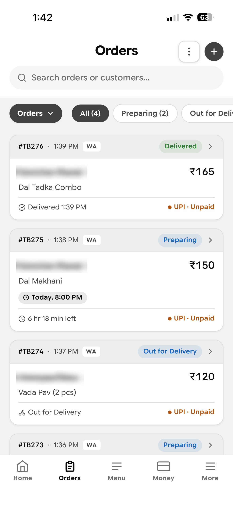

### 2 · The owner opens the ticket

Everything about one order on a single screen — source, timing, items, and the customer's contact and address with one-tap Call and WhatsApp. The speaker icon reads the whole ticket aloud in the owner's language, for when their hands are covered in dough.

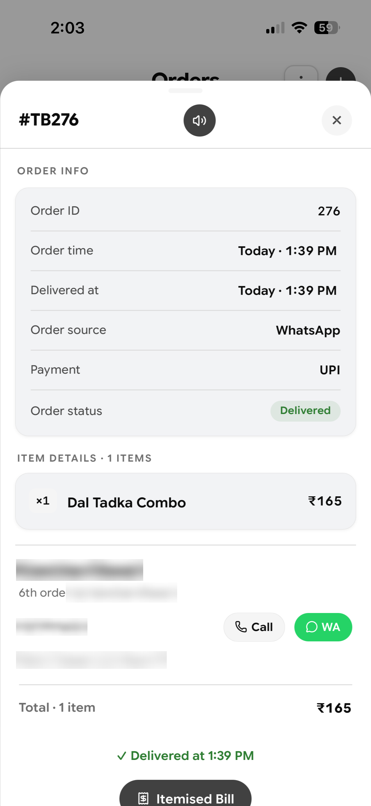

### 3 · An itemised bill is generated

One tap produces a proper receipt: line items, totals, payment status and a **UPI QR code the customer can scan to pay**.

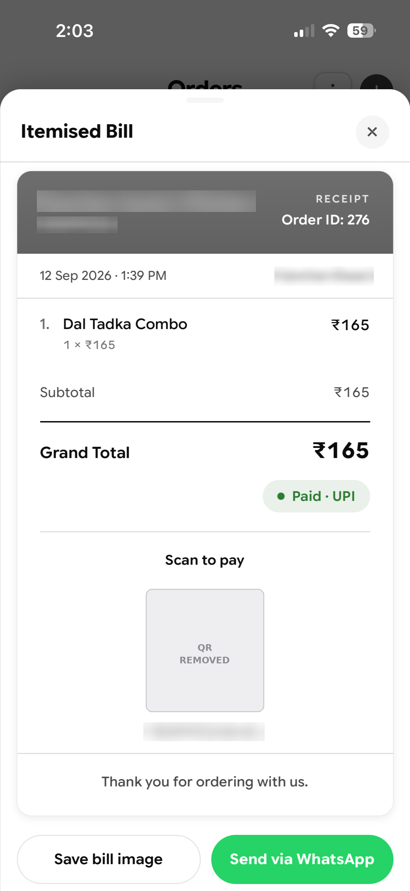

### 4 · It goes back out on WhatsApp, and gets marked paid

**Send via WhatsApp** delivers the bill into the same chat the order came from. When the money lands, the owner marks it paid and the dues update everywhere.

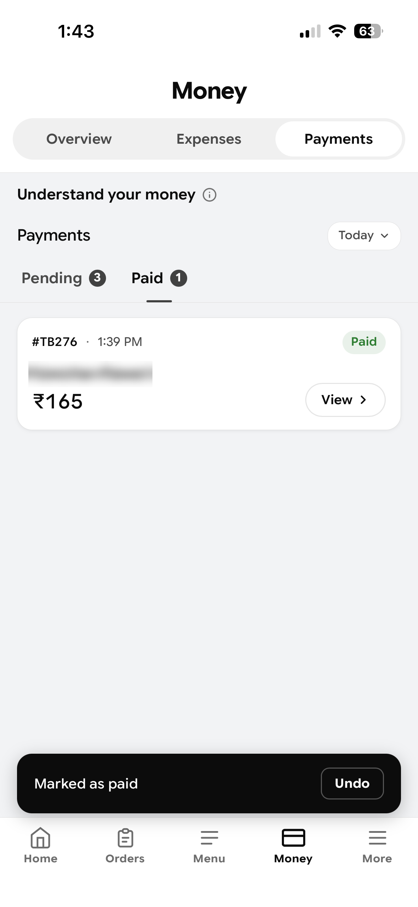

That is the loop: **WhatsApp → ticket → bill → WhatsApp → paid.** No aggregator, no commission, no app for the customer to install.

---

## The customer side

Customers order from a public link the kitchen shares — no app install, no account. The storefront shows the live menu with photos, prices and the kitchen's star rating, and orders placed here drop straight into the owner's list.

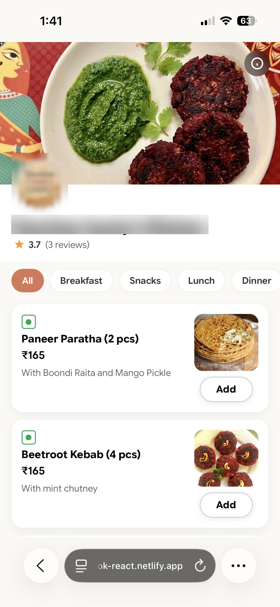

*Every public write on this page goes through a server-side Cloud Function — see [Architecture](#architecture-notes).*

---

## The daily dashboard

The first thing the owner sees: what sold, what is still cooking, what is owed, and what needs attention today — low stock, expiring subscriptions, unpaid orders.

<table>
<tr>
<td align="center">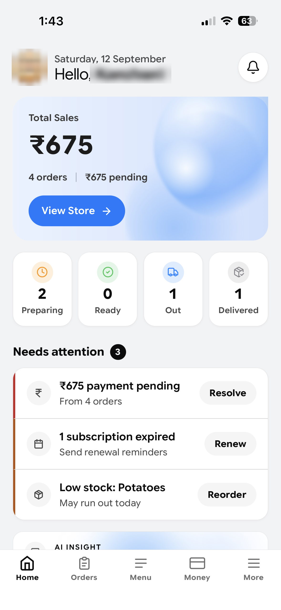 <b>English · light</b></td>
<td align="center">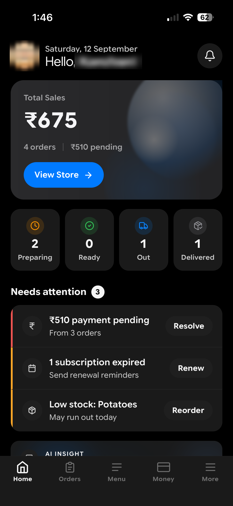 <b>English · dark</b></td>
<td align="center">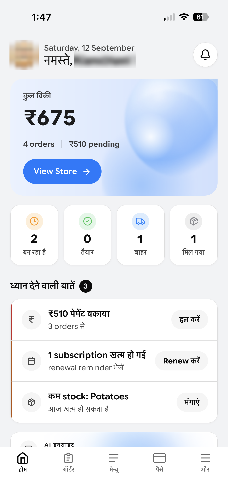 <b>हिन्दी · Hindi</b></td>
</tr>
</table>

**The same screen, three ways.** Full light and dark themes, and a complete UI translation across **English, Hindi and Kannada** — roughly **1,650 translated strings per language**, verified by an automated coverage script rather than spot-checks. The owner's language is not an afterthought bolted onto an English app.

---

## Money

Every rupee in and out, and what it means.

<table>
<tr>
<td align="center">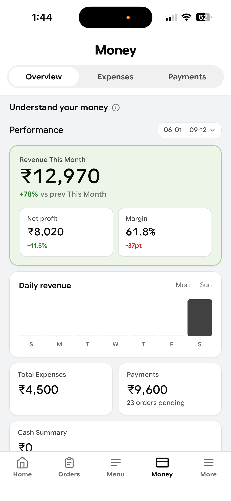 <b>Revenue, profit, margin</b></td>
<td align="center">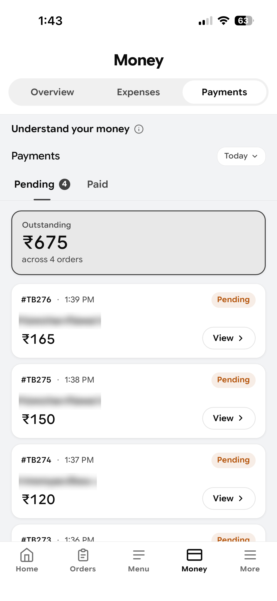 <b>Outstanding dues</b></td>
<td align="center">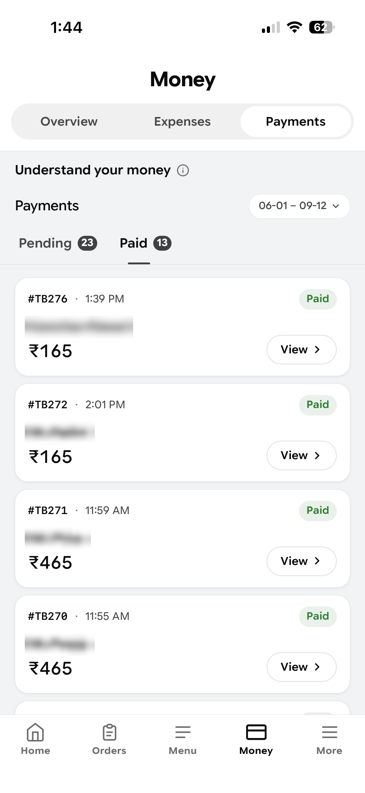 <b>Payment history</b></td>
</tr>
</table>

Profit here is real profit, not revenue wearing a disguise: each order is costed as **revenue − dish costs − packaging − delivery**, so the owner can see that a ₹165 order with ₹10 of packaging is not the same as one with ₹40.

---

## Business insight

Three views over the same data — where orders come from, what they earn, and where the money goes.

<table>
<tr>
<td align="center">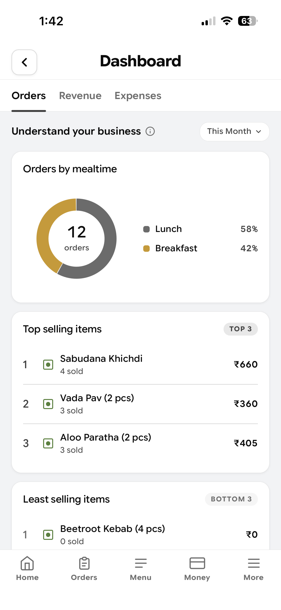 <b>Orders & top items</b></td>
<td align="center">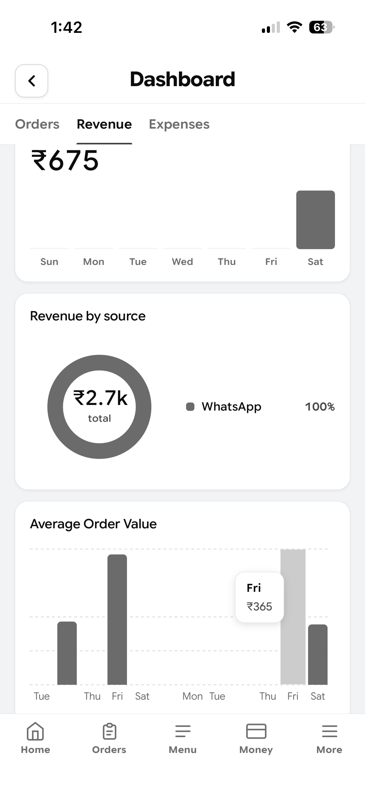 <b>Revenue by source</b></td>
<td align="center">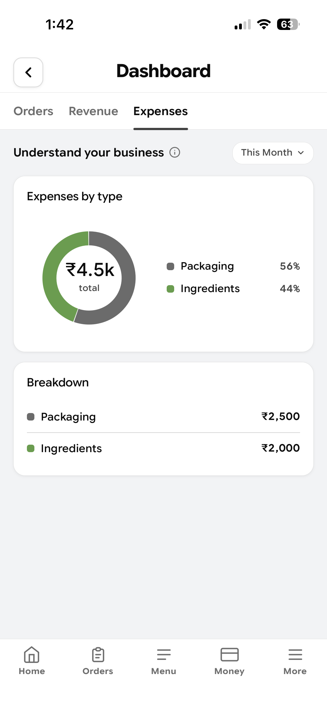 <b>Expense breakdown</b></td>
</tr>
</table>

The **revenue-by-source** chart is the product thesis proving itself: for this kitchen, **100% of revenue arrives through WhatsApp.** That is precisely why the app is built around WhatsApp instead of trying to move anyone off it.

---

## Kitchen Assistant

<table>
<tr>
<td width="57%" valign="top">

A <b>rules-based insights engine</b> — 14 rules over the kitchen's own live order, stock, payment and menu data — that surfaces what needs attention today, ranked by urgency, each with an action attached.

It catches things like: ingredients about to run out before they break an order, an order that has been preparing too long (with a ready-to-send apology message for WhatsApp), unpaid orders piling up, and which dish is actually carrying the week.

The logic is <b>deterministic and auditable</b> — no model calls, no inference costs, no unpredictable output. Every insight is explainable, arrives in the owner's chosen language, and deep-links to the screen where it can be acted on.

</td>
<td width="43%" align="center" valign="top">
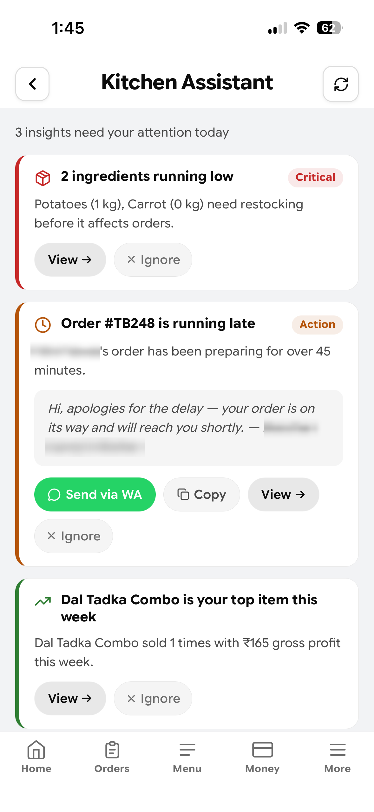
</td>
</tr>
</table>

---

## Catalogue, stock and data

<table>
<tr>
<td align="center">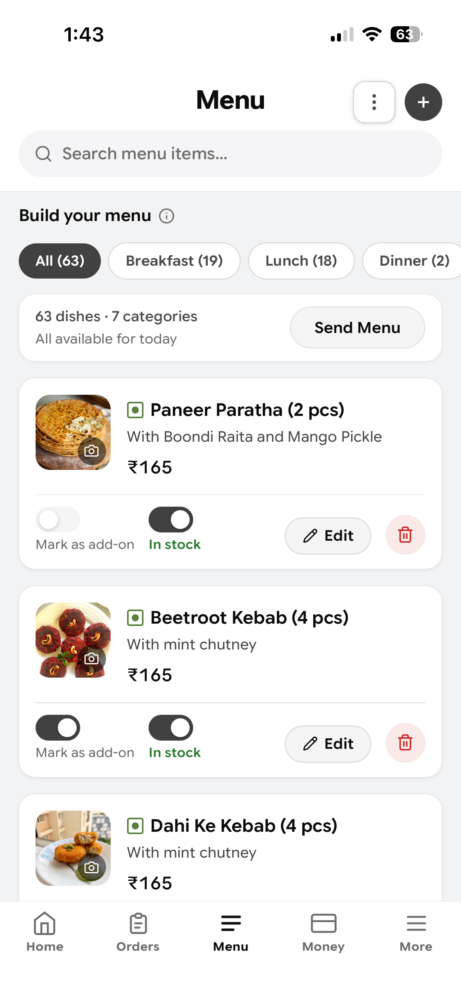 <b>Menu · 63 dishes, 7 categories</b></td>
<td align="center">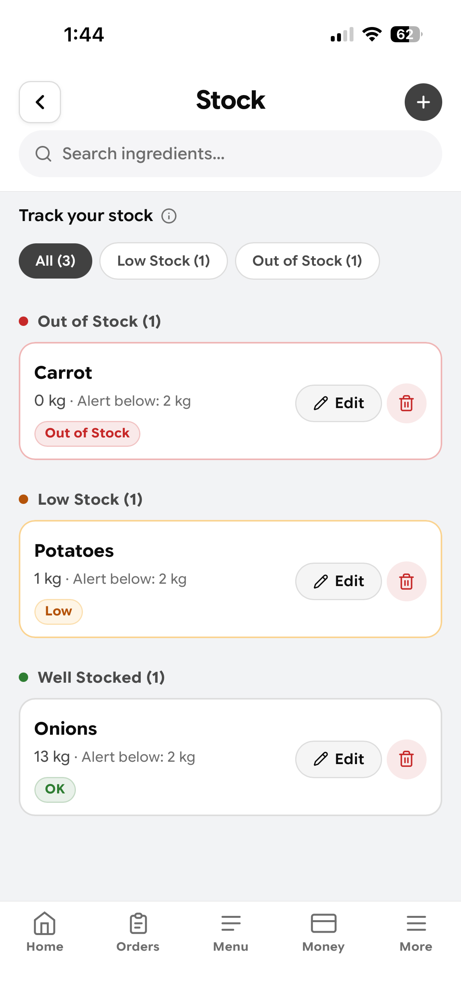 <b>Ingredient stock</b></td>
<td align="center">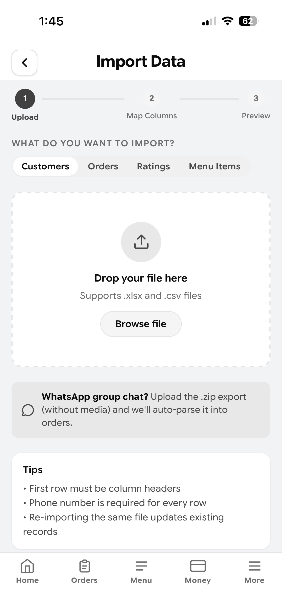 <b>Import</b></td>
</tr>
</table>

**Menu** holds each dish with its price, photo, availability and cost-to-make. **Stock** tracks ingredients with per-item reorder thresholds, depleting automatically as orders go out.

**Import** is the onboarding answer to "I already have months of history." A kitchen can upload a spreadsheet — or **export its WhatsApp group chat and have the app parse the messages into structured orders and customers.** Meeting the business where its data already lives is the difference between a tool someone tries and a tool someone adopts.

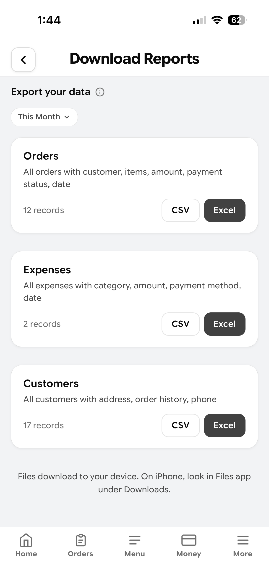

**Reports** export orders, expenses and customers to CSV or Excel — the owner's data stays the owner's, including the ability to take it and leave.

---

## Tech stack

Every item below is verified against the codebase.

| Layer | Technology |
|---|---|
| **Frontend** | React 19 · TypeScript · Vite · Tailwind CSS 4 · React Router 6 |
| **Authentication** | Firebase Auth — phone number + SMS OTP (no passwords) |
| **Database** | Cloud Firestore, with server-authoritative Security Rules |
| **Backend** | Firebase Cloud Functions (TypeScript, `asia-south1`) |
| **Serverless** | Netlify Functions — transactional email |
| **File storage** | Firebase Storage — kitchen branding and dish photos |
| **Voice** | Google Cloud Text-to-Speech — WaveNet, locale-matched |
| **Charts** | Recharts |
| **Data import/export** | PapaParse (CSV) · SheetJS (Excel) · JSZip (WhatsApp chat exports) |
| **Payments** | UPI deep links + generated QR codes |
| **Hosting** | Netlify — SPA routing, cache and security headers |
| **App shell** | Installable Progressive Web App |
| **Internationalisation** | English · Hindi · Kannada, with an automated coverage audit |

**Scale:** ~190 TypeScript/TSX files · ~44,000 lines · 40 screens · 4 Cloud Functions · ~270 commits.

---

## Architecture notes

**Public writes are server-only.** The customer storefront and feedback pages are unauthenticated. Rather than letting an unauthenticated browser write to the database, every public write goes through a Cloud Function using the Admin SDK — `placeOrder` and `submitFeedback`. The Firestore rules deny public writes outright, so a crafted request cannot forge an order, tamper with the order counter, or reach another kitchen's data.

**Default deny, then grant narrowly.** The security rules open with a blanket `allow read, write: if false` and grant access from there. Subscription and billing-tier documents are server-only, so a client cannot promote itself to a paid plan. Customer PII is deliberately not listable — single-document reads are permitted where a page genuinely needs one, but nothing can enumerate the customer table.

**Voice that doesn't sound like a robot.** The device's default voice reads Indian names and dish names badly. `synthesizeSpeech` calls Google Cloud TTS with locale-matched WaveNet voices (`en-IN`, `hi-IN`, `kn-IN`) deployed to `asia-south1` for a short round trip from India. WaveNet bills per character, so the function is defended on four sides — App Check, an authentication gate, a plan check and a per-request character cap — and the plan check **fails closed**: if the database hiccups, voice is denied rather than given away. When the callable is unavailable the client falls back to browser speech synthesis, so the feature degrades instead of breaking.

**Security was reviewed before real customers were let in.** A phased pre-launch audit ran before the ordering link went out. It found and fixed two real vulnerabilities in the transactional email function: an **open relay** (any unauthenticated caller could send mail from a trusted domain to any recipient) and an **HTML/header injection** hole (user-supplied names were interpolated raw into the message body and subject line).

**Known limitations are written down, not hidden.** The private repository documents what does not work and why — including a multi-month iOS PWA viewport bug, the nine mitigation attempts that failed, and the reasoning for parking it rather than shipping a fragile patch.

---

## My role

I am not a professional developer. I built OrdersIn by **directing and managing an AI-assisted development process**, and that process is the skill this project demonstrates.

- **Defined all product requirements** — who this is for, what belongs on which screen, what a one-person business needs to see first thing in the morning, and what to deliberately leave out. The positioning, the WhatsApp-first strategy, and the decision to serve businesses avoiding the aggregators are mine.
- **Directed the full build across ~270 commits** — specifying each feature, reviewing what came back, and holding the architectural decisions: server-authoritative security rules over client-side trust, Cloud Functions for every public write, a PWA over a native app, three languages from the start rather than "later".
- **Ran the testing and debugging cycles personally** — on real iOS and Android devices, reproducing failures, driving each to a fix and re-testing. I refused work that arrived with "couldn't build or lint" caveats attached.
- **Owned security** — commissioned the phased pre-launch audit, then deployed the resulting hardened Firestore and Storage rules and Cloud Functions myself.
- **Run it as a live product** — Firebase project, Netlify deployments, environment configuration, onboarding a real home kitchen, and supporting it while it takes real orders from real customers.

The claim here is not that I hand-wrote the TypeScript. It is product judgment, engineering direction, the discipline to insist things were actually finished, and the persistence to take a real problem all the way to a working product that a business depends on.

---

## Source code

**The source repository is private.** OrdersIn is a live product handling real customer orders and real payment data, so the code is not published.

**I am happy to walk through the codebase, the architecture, or the security rules with serious enquiries** — screen share or a private repository invitation, whichever suits.

---

## Notes on these screenshots

Every screenshot is from the live application running on a real phone with real data. Customer names, phone numbers, addresses, the kitchen's identity and all payment details have been **redacted to protect the privacy of real people**. The kitchen featured has given permission to be shown. Nothing has been mocked up or recreated for presentation.

---

<h3><a href="https://tiffinbook-react.netlify.app">Try the live app &rarr;</a></h3>

Built and directed by <b>Nitin Rawal</b>

